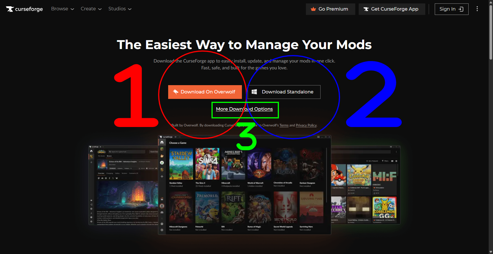
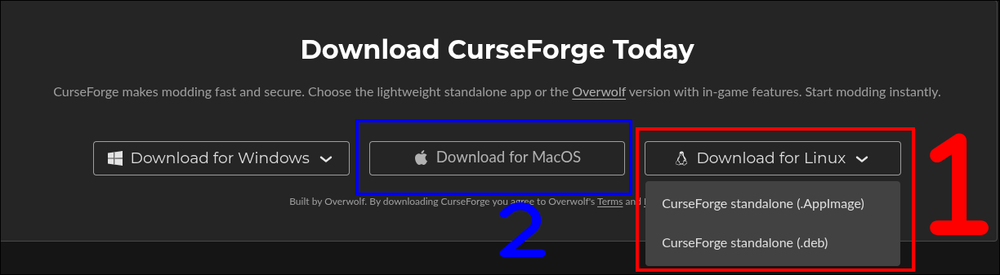
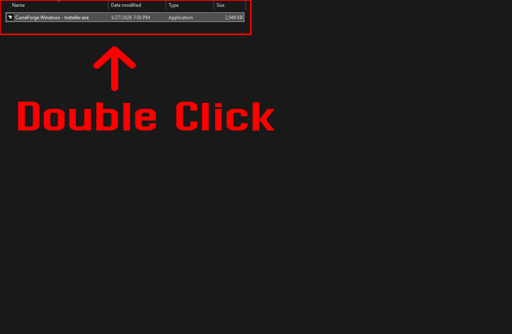
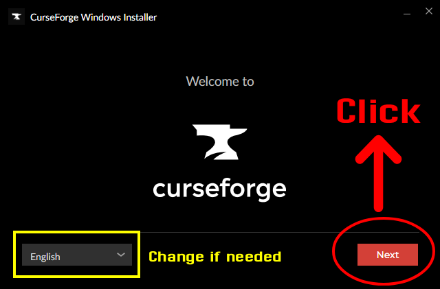
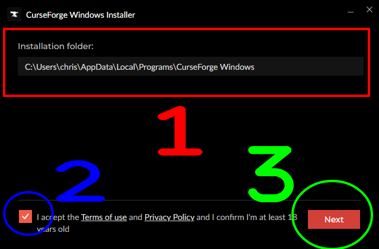
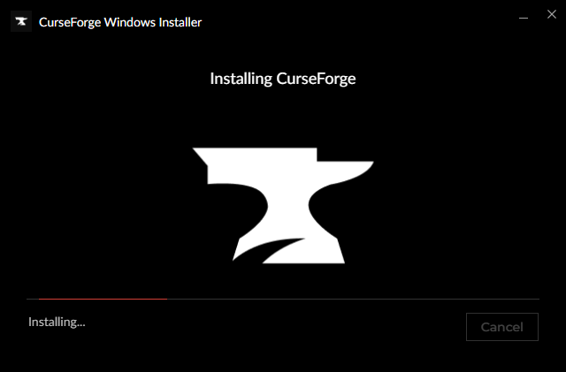
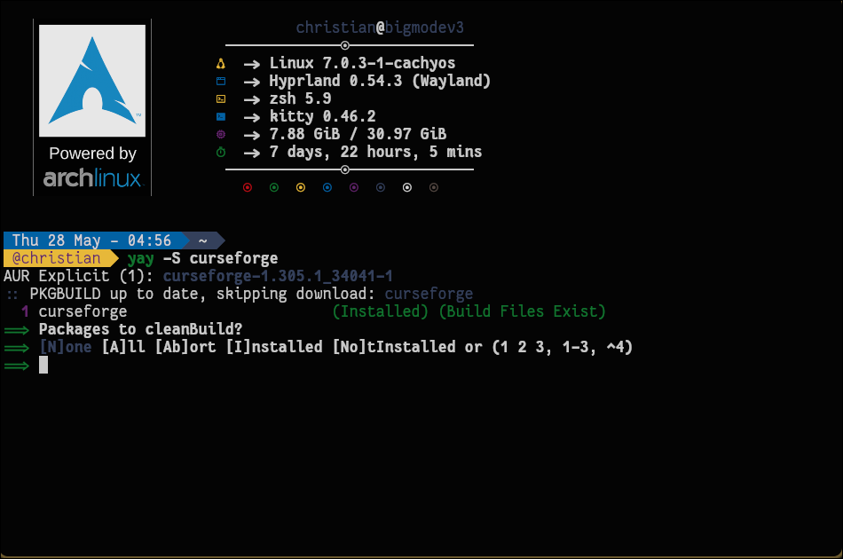

In this guide we will show you how to simply download and install the official [Curseforge](https://www.curseforge.com/) app launcher onto your computer.

[**View Guide On TMC (Recommended Due To Better Formatting)**](https://blog.moddingcommunity.com/how-to-download-install-curseforge-app/)

[Curseforge](https://www.curseforge.com/) is a very popular modding platform that hosts a large variety of mods for different games, including [Minecraft](https://www.minecraft.net/), [World of Warcraft](https://worldofwarcraft.com/), and many more. The Curseforge app launcher is a convenient way to manage your mods, as it allows you to easily browse and install mods directly from the app, as well as keep them up to date. It also allows you to create and manage modpacks, which are collections of mods that can be easily shared with others via a single ZIP file or a digit code.

## Table of Contents
- [Requirements](#requirements)
- [Downloading](#downloading)
- [Installing](#installing)
- [Notes](#notes)
    - [Linux Download Notes](#linux-download-notes)
    - [Troubleshooting](#troubleshooting)
    - [Permission Issues](#permission-issues)
- [See Also!](#see-also)
- [Conclusion](#conclusion)

## Requirements
- The Operating Systems supported: **Windows 10 or later**, **macOS**, and **Linux**
- At least 1 GB of free storage space.
- A basic understanding of how to use a computer, navigate the file system, and install software.

Most images and steps are based on the Windows version of the Curseforge app, but the process is similar for macOS and Linux as well.

## Downloading
Downloading the Curseforge app is a simple and straightforward process. However, the website offers a standalone edition of the app and a version that installs [Overwolf](https://www.overwolf.com/).

[Overwolf](https://www.overwolf.com/) is a platform that hosts various gaming apps, including the Curseforge app. There are users who don't feel installing Overwolf is necessary, and that's perfectly fine. Therefore, most users tend to download the **standalone version** of the Curseforge app.

Please follow the steps below:

1. Visit the Curseforge download [page here](https://www.curseforge.com/download/app).
2. Click on the **Download** on whatever option you prefer.
    - Click **Download On Overwolf** (1) if you want to install the version that includes Overwolf.
    - Click the **Download Standalone** button (2) if you want to install the version that doesn't include Overwolf.
    - If your OS isn't listed or supported, or you want to view other versions, lick the **More Download Options** button (3) to view all available versions of the app.
    - **NOTE**: The download page tries to automatically detect your OS and will show you the recommended version for your system, but you can still choose to download any version you want.

2. If you clicked additional options, you will be taken to a page that lists all available versions of the app. Select the operating system you are using which may show a drop-down menu with different options to download from.
    - For example:
        - Click the **Download for Linux** button (1) to download the Linux version of the app.
        - Click the **Download for macOS** button (2) to download the macOS version of the app.

4. Save the installer file to your computer.
    - For Windows, the file will be named something like `CurseForge-Setup.exe` by default.
    - On Linux, it will be either an AppImage or a `.deb` file, depending on the version you choose.
    - On macOS, it will be a `.dmg` file.

## Installing
Now to install the Curseforge app. Simply run the installer file you downloaded by either **double-clicking it** or **right-clicking** and **selecting Open**.



This will open the installation wizard. Follow the steps below.

1. Choose your preferred language for the installation process and click the **Next** button to proceed to the next step.

2. Choose the installation location for the app (1).
    - In most cases, you can leave this as the default location.
    - This is not where your mods will be stored, but rather where the app itself will be installed. The app will manage your mods in a separate location.
3. Make sure to read and agree to the terms and conditions (2) by **checking the box**.
4. Click the **Next** button (3) to start the installation process.


The installation process may take a few minutes to complete. Once it's done, you can click the **Finish** button to exit the installer and launch the Curseforge app.



**NOTE**: While installing Curseforge, it will ask you if you'd like to install additional software. This is optional and not required to use the Curseforge app, so you can choose to either install it or skip it by clicking the **No thanks** button. Most users choose to **skip it** to avoid installing unnecessary software on their computer.

## Notes
### Linux Download Notes
On the Curseforge website, there are two versions of the app available for Linux:

1. An AppImage file
    - A portable version of the app that can be run without installation.
2. A `.deb` file
    - A package that can be installed using a package manager like `dpkg` or `apt`. This is commonly used for Debian-based distributions like Ubuntu.

If you've downloaded the `.deb` file, you can install it using the following command in the terminal:

```bash
sudo apt install -f ./curseforge-latest-linux.deb
```

Make sure to replace `curseforge-latest-linux.deb` with the actual name of the downloaded file if you've changed it!

On Arch or CachyOS, I was able to install Curseforge with the AUR package repository using `yay`:

```bash
yay -S curseforge
```



### Troubleshooting
#### Curseforge App Not Launching
If you are having trouble launching the Curseforge app after installation, there are a few things you can try to troubleshoot the issue:

1. Try forcefully closing the app and restarting it.
    - On Windows, do this by opening the Task Manager (**CTRL + Shift + Esc**), finding the Curseforge app in the list of running processes, right-clicking it, and selecting **End Task**.
    - On Linux and macOS, you can use the `kill` command in the terminal to forcefully close the app. First, find the process ID (PID) of the Curseforge app by running the following command:
    ```bash
        # Get app PID
        PID=$(pgrep curseforge)

        # Kill with PID (using -9 to force kill)
        kill -9 $PID
    ```
2. Restart your computer and try launching the app again.
3. If the app still doesn't launch, try uninstalling and reinstalling it.
4. Check for any updates to the app or your computer's operating system, as this may resolve any compatibility issues.

### Permission Issues
If you are having trouble installing or running the Curseforge app due to permission issues, you may need to run the installer or the app with elevated permissions. On Windows, you can do this by right-clicking the installer or the app and selecting **Run as administrator**. On Linux and macOS, you can use the `sudo` command in the terminal to run the installer or the app with elevated permissions.

## See Also!
* [Prism Launcher](https://prismlauncher.org/) - An alternative mod launcher that has similar features to the Curseforge app along with a good reputation in the Minecraft modding community. It also supports importing mods and modspacks from Curseforge, making it a great option for users who want to manage their mods without using the Curseforge app.
* [ATLauncher](https://atlauncher.com/) - Another alternative mod launcher that is popular in the Minecraft modding community. It also supports importing mods and modpacks from Curseforge, and has a large selection of modpacks available for download.
* [Modrinth App](https://modrinth.com/app) - A mod launcher for the Modrinth platform, which is another popular mod hosting site. It has a similar interface to the Curseforge app and allows you to easily browse and install mods from [Modrinth](https://modrinth.com).

## Conclusion
By now, you should have successfully downloaded and installed the Curseforge app onto your computer! You can now launch the app and start browsing for mods and modpacks to install. The Curseforge app makes it easy to manage your mods and keep them up to date, so you can focus on enjoying your modded gaming experience.

In the next article, we will be showing you the basics of the Curseforge app and how to use it to manage your mods and modpacks. Stay tuned!

Guides we create are always open to edits and improvements, so if you have any suggestions or notice any issues, feel free to contribute by creating a [pull request](https://github.com/modcommunity/how-to-download-and-install-vortex/pulls) on our GitHub repository!

Please join our [Discord server](https://discord.gg/moddingcommunity) if you have any questions or need help with anything related to modding or our guides!

Happy modding!